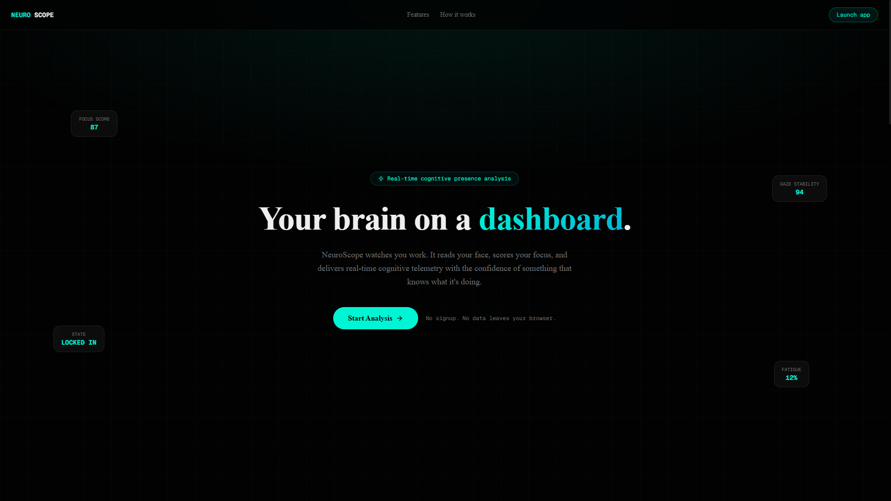
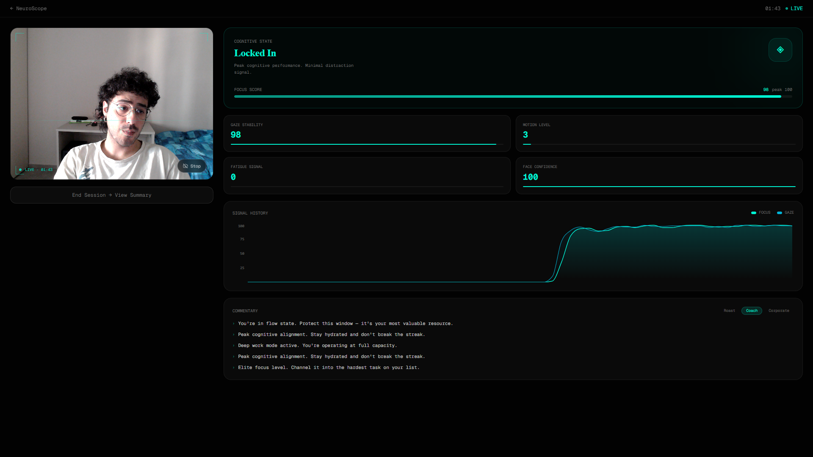
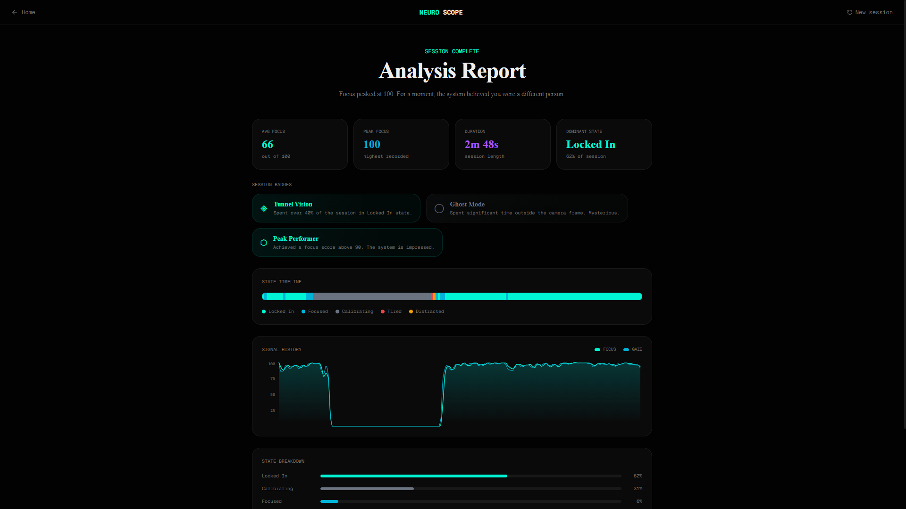

# NeuroScope

**Real-time cognitive presence analysis — entirely in your browser.**

NeuroScope uses your webcam and computer vision to track facial signals while you work, translating them into live productivity metrics, simulated cognitive states, and contextual commentary. No backend. No uploads. No scientific accuracy — but a lot of convincing UI.

> Built as a portfolio project to demonstrate real-time systems, computer vision integration, and UI/UX polish in a browser-first architecture.

---

## Live Demo

> **[neuro-scope-fxy1.vercel.app](https://neuro-scope-fxy1.vercel.app)**

---

## What it does

| Feature | Description |
|---|---|
| **Face Tracking** | MediaPipe Face Landmarker processes 468 facial landmarks per frame via WebAssembly |
| **Synthetic Metrics** | Focus Score, Gaze Stability, Motion Level, Fatigue Signal — smoothed with rolling averages |
| **Cognitive States** | Locked In · Focused · Distracted · Tired · Confused Genius · Calibrating |
| **Commentary Engine** | Rule-based feedback system in three tones: Roast, Coach, Corporate |
| **Live Dashboard** | Real-time charts, animated metric cards, state panel with color transitions |
| **Session Summary** | Recap with badges, state timeline, breakdown chart, and a verdict |

---

## Screenshots

| Landing                       | Dashboard                       | Summary                       |
|-------------------------------|---------------------------------|-------------------------------|
|  |  |  |

---

## Architecture

```
Webcam → Face Tracker → Metrics Engine → State Resolver → Commentary Engine → UI
           (MediaPipe)   (rolling avg)    (heuristics)      (rule-based)
```

Everything runs client-side. The pipeline looks like this:

```
useWebcam          — stream lifecycle, permission states, cleanup
useVisionLoop      — rAF loop throttled to 15fps, feeds frames to face tracker
useSessionMetrics  — derives SmoothedMetrics from FaceTrackingResult each frame
useCommentary      — fires contextual comments with cooldown + state stability checks
```

---

## Tech Stack

| Layer | Tech |
|---|---|
| Framework | Next.js 15 (App Router) |
| Language | TypeScript (strict) |
| Styling | Tailwind CSS v4 + shadcn/ui |
| Animation | Framer Motion |
| Charts | Recharts |
| Computer Vision | MediaPipe Tasks Vision — Face Landmarker |
| Deploy | Vercel |

---

## Technical Highlights

**Browser-first processing** — MediaPipe runs via WebAssembly entirely client-side. No video frames are sent to any server.

**Heuristic metrics pipeline** — Raw facial signals (nose tip delta, Eye Aspect Ratio, gaze vector variance) are normalized, smoothed with configurable rolling averages, and composed into a focus score. Deterministic, stable, and visually convincing.

**State machine** — Six cognitive states mapped from metric thresholds in a priority-ordered resolver. State transitions trigger commentary and UI color changes.

**Commentary engine** — 90 handcrafted phrases across 18 pools (6 states × 3 tones). Anti-repetition tracking, cooldown gating, and stability checks ensure comments feel contextual rather than random.

**No memory leaks** — `useWebcam` stops all media tracks and clears `srcObject` on cleanup. `useVisionLoop` cancels `requestAnimationFrame` and calls `destroyFaceTracker()` on unmount.

---

## Project Structure

```
/app
  /(marketing)/page.tsx       — Landing page
  /(product)/dashboard/       — Live session
  /(product)/summary/         — Session recap
  /opengraph-image.tsx        — OG image (edge runtime)

/components
  /landing/                   — Hero, FeatureCards, MockDashboardPreview, HowItWorks, CTA
  /dashboard/                 — WebcamPanel, StatePanel, MetricCards, CommentaryFeed, DashboardShell
  /charts/                    — MetricChart (Recharts area chart)
  /summary/                   — SummaryStats, BadgeDisplay, StateTimeline

/lib
  /vision/
    face-tracker.ts           — MediaPipe adapter (singleton, GPU delegate)
    metrics.ts                — RollingAverage, computeMetrics, resetMetrics
    heuristics.ts             — resolveState, STATE_CONFIG
    canvas-draw.ts            — Landmark rendering on canvas overlay
  /ai/
    commentary.ts             — generateComment, phrase pools
  /utils/
    session-storage.ts        — localStorage serialization, deriveStats
    badges.ts                 — assignBadges, generateVerdict

/hooks
  use-webcam.ts               — Stream lifecycle, permission state machine
  use-vision-loop.ts          — rAF loop, 15fps throttle, dynamic imports
  use-session-metrics.ts      — Metric accumulation, snapshot history
  use-commentary.ts           — Cooldown + stability gating
```

---

## Getting Started

```bash
# 1. Clone
git clone https://github.com/maton111/neuro-scope
cd neuroscope

# 2. Install
npm install

# 3. Environment (optional — only needed for OG image on custom domain)
cp .env.example .env.local
# Edit NEXT_PUBLIC_SITE_URL if deploying to a custom domain

# 4. Run
npm run dev
# → http://localhost:3000
```

**Requirements:** A browser with webcam access. Chrome or Edge recommended for best WebAssembly performance.

---

## Deploy to Vercel

```bash
# Install Vercel CLI
npm i -g vercel

# Deploy
vercel
```

Set `NEXT_PUBLIC_SITE_URL` to your Vercel deployment URL in the project environment variables.

---

## Metrics: how they work

| Metric | Signal | Formula |
|--------|--------|---------|
| **Motion Level** | Nose tip Δposition between frames | `delta × 2000`, clamp 0–100 |
| **Gaze Stability** | Nose–midpoint vector variance | `100 − (Δvector × 3000)` |
| **Fatigue Signal** | Eye Aspect Ratio (EAR) | `(0.30 − avgEAR) / 0.20 × 100` |
| **Focus Score** | Composite | `gaze×0.4 + (100−motion)×0.3 + (100−fatigue)×0.2 + confidence×0.1` |

All metrics are smoothed with rolling averages (15–25 frame windows).

---

## Cognitive States

| State | Trigger |
|-------|---------|
| **Locked In** | focus > 84, motion < 18, gaze > 78 |
| **Focused** | focus > 60, motion < 40 |
| **Distracted** | motion > 55 or gaze < 32 |
| **Tired** | fatigue > 65 |
| **Confused Genius** | focus 40–70, motion > 25 |
| **Calibrating** | face not detected or confidence < 0.3 |

---

## Session Badges

| Badge | Condition |
|-------|-----------|
| Tunnel Vision | ≥40% session in Locked In |
| The Professional | ≥50% session Focused |
| Sleep-Deprived Wizard | ≥35% session Tired |
| Chaos Agent | ≥40% session Distracted |
| Confused Genius | ≥30% session Confused Genius |
| Ghost Mode | ≥30% session Calibrating |
| Peak Performer | Peak focus score ≥90 |
| Marathon Runner | Session ≥15 minutes |

---

## Notes on accuracy

NeuroScope is not a scientific tool. All metrics are heuristic-based, intentionally approximate, and optimized for UX rather than clinical correctness. The system is designed to feel intelligent, not to be intelligent.

---

## Future improvements

- LLM-generated commentary (Claude API / streaming)
- Session history with Supabase
- Shareable recap image export
- Voice feedback
- Multiplayer / leaderboard
- Theme switching (cyberpunk · minimal · corporate)

---

## Author

**Mattia Archinà**

---

## License

MIT